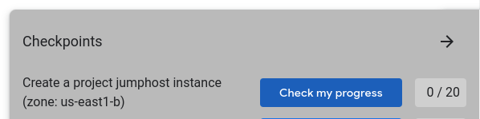

# Getting Started: Create and Manage Cloud Resources: Challenge Lab

[Lab link](https://www.cloudskillsboost.google/focuses/10258?parent=catalog)

## Task 1. Create a project jumphost instance



## Task 1. Create a project jumphost instance

> Please navigate to the compute engine > VM instance & click on create instance. 
Location: as default or asper checkpoint. 
Instance Name: <As mentioned in instruction> 
Machine type: N1 (f1-macro).


* Run the following from the **Cloud Terminal**:
## Task 2. Create a Kubernetes service cluster

### Creating the GKE zonal cluster "jooli-hello"
``` yaml
gcloud container clusters create --machine-type=e2-medium --num-nodes 3 --network nucleus-vpc --zone=<INSERT ZONE HERE> jooli-hello
gcloud container clusters get-credentials jooli-hello --zone=<INSERT SAME ZONE AS ABOVE>
```
### Using the Docker container hello app and deploying it on this cluster as a placeholder
``` yaml
kubectl create deployment hello-server --image=gcr.io/google-samples/hello-app:2.0
```
### Exposing the app on a specific port
``` yaml
kubectl expose deployment hello-server --type=LoadBalancer --port <INSERT PORTNO HERE>
```

### check if External IP is generated... when it's done you may check your progress
``` yaml
kubectl get service
```

## Task 3. Set up an HTTP load balancer
### 1. Template
``` yaml
gcloud compute instance-templates create web-server-template \
    --network nucleus-vpc \
    --machine-type=g1-small \
    --image-family=debian-11 \
    --image-project=debian-cloud \
    --metadata-from-file startup-script=startup.sh \
    --region us-east1
```


### 2. Target pool
``` yaml
gcloud compute target-pools create nginx-pool --region us-east1
```

### 3. MIG of 2 based on Template
``` yaml

gcloud compute instance-groups managed create web-server-group \
    --base-instance-name web-server \
    --size=2 \
    --template=web-server-template \
    --target-pool nginx-pool \
    --region us-east1
```

#### to check
``` yaml
gcloud compute instances list
```

### 4. Firewall rule
``` yaml
gcloud compute firewall-rules create allow-tcp-rule-192 \
    --allow tcp:80 \
    --network nucleus-vpc
```

### 5. Health check
``` yaml
gcloud compute http-health-checks create http-basic-check
```

### 6. Backend service
``` yaml
gcloud compute instance-groups managed \
    set-named-ports web-server-group \
    --named-ports http:80 \
    --region us-east1


gcloud compute backend-services create web-server-backend \
    --protocol HTTP \
    --http-health-checks http-basic-check \
    --global

gcloud compute backend-services add-backend web-server-backend \
    --instance-group=web-server-group \
    --instance-group-region us-east1 \
    --global
```

### 7. Url map
``` yaml
gcloud compute url-maps create web-server-map \
    --default-service web-server-backend`

gcloud compute target-http-proxies create http-lb-proxy \
    --url-map web-server-map
```

### 8. Forwarding rule
``` yaml
gcloud compute forwarding-rules create http-content-rule \
    --global \
    --target-http-proxy http-lb-proxy \
    --ports 80

gcloud compute forwarding-rules list
```
